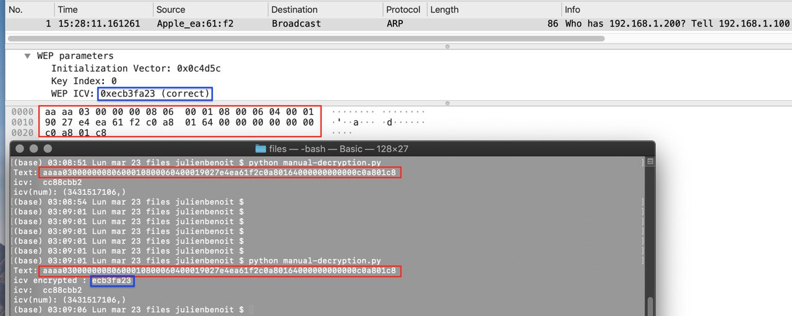
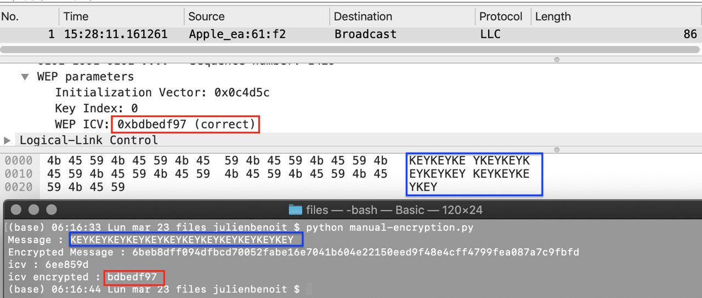
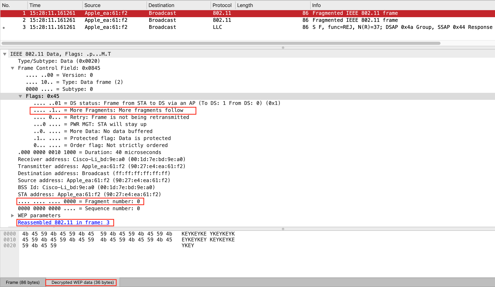
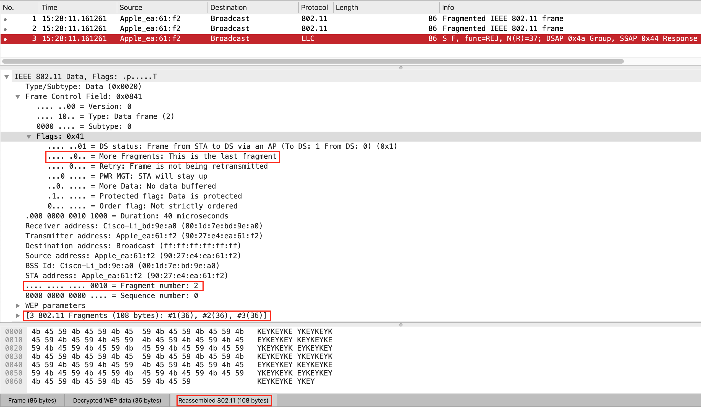

Auteurs : Benoit Julien et Sutcu Volkan

Date : 30.03.2020

# Sécurité des réseaux sans fil - Laboratoire 802.11 Sécurité WEP

### 1. Déchiffrement manuel de WEP

**Comparer la sortie du script avec la capture text déchiffrée par Wireshark**

Nous pouvons tout d'abord observer que l'ICV sur wireshark reste chiffré et pour confirmer qu'il est correct, dans un premier temps, wireshark nous indique par le biais du mot "correct" en face de l'ICV et dans un second temps, nous avons affiché sur la console (encadrés bleus) l'ICV chiffré qui correspond exactement à celui sur wireshark.

Puis, via les encadrés rouges, nous pouvons voir que le texte affiché sur la console est bien le même que celui déchiffré sur wireshark, ce qui prouve qu'il est correcte.

### 2. Chiffrement manuel de WEP

Tout comme l'étape précédente, nous pouvons voir que la capture wireshark que nous avons créé déchiffre bien le paquet généré par notre code et qu'en comparant avec la console, nous obtenons d'une part, le même ICV qui est correct (encadrés rouges), et d'une autre le même message (encadrés bleus)

### 3. Fragmentation

Pour tester notre code, nous avons fragmenté un paquet de 108 bytes en 3 fragments, chacun valant 36 bytes. Ci-dessous, les captures wireshark du premier et dernier paquet en détails.

**Premier fragment**

Nous pouvons observer dans ce premier paquet qu'il contient bien le more fragment à 1 signifiant qu’un nouveau fragment va être reçu et que le numéro de fragment est bien le 0, à savoir le premier. En bas, nous pouvons également observer la data qui est décryptée.

**Dernier fragment**

Nous pouvons observer dans ce dernier paquet qu'il contient bien le more fragment à 0 signifiant qu'il n'y a pas de nouveau fragment qui va être reçu et que le numéro de fragment est bien le 2, à savoir le troisième. En bas, nous pouvons également observer que le paquet est entièrement réassemblé via le dernier encadré rouge.